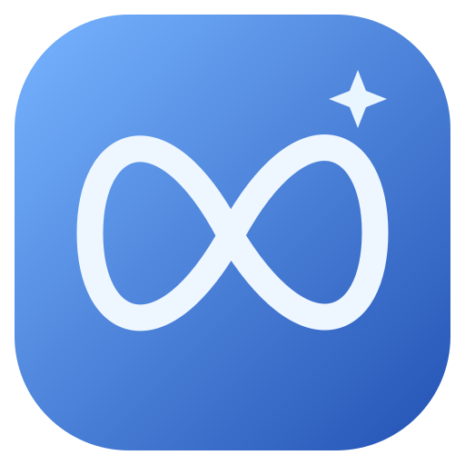

<div align="center">
  
  <h1>Meta-chan</h1>
  <p><strong>A little company. A lot of possibility.</strong></p>
  <p>A local-first anime desktop companion powered by Meta's Llama models.</p>
  <p>Electron · Ollama · JavaScript · MIT</p>
  
</div>

Meta-chan lives on your desktop, gives you a space to think out loud, and keeps the context you choose to save. Ask for help with code, brainstorm a project, or turn a busy day into a plan.

This is an **independent fan project**, not an official Meta product. The initial source release has not been tested or packaged into installers.

## What is included

- **Local AI chat:** streamed responses from a Llama model running through Ollama, with cancellation and readable connection errors.
- **Floating desktop companion:** draggable character window, optional always-on-top mode, tray controls, and `Ctrl/Cmd + Shift + M` to show or hide it.
- **Persistent conversation:** the current chat survives app restarts; recent history is included in the model context.
- **Memory you control:** explicitly save preferences and project notes; delete them at any time.
- **Task list:** add, complete, reopen, and remove tasks. Open tasks are included as context for planning requests.
- **Spoken replies:** optional system text-to-speech and a Read aloud action on completed messages.
- **Data controls:** JSON export, open data folder, clear personal data, and reduced motion.
- **Replaceable character:** editable vector art with subtle motion; no external image or font requests.

## Run it

Install [Node.js 24 or newer](https://nodejs.org/) and [Ollama](https://ollama.com/).

```bash
git clone https://github.com/ClaudeAIOfficial/meta-chan.git
cd meta-chan
npm ci
ollama pull llama3.2:3b
npm start
```

Keep Ollama running. On systems where it does not run as a background app, start `ollama serve` in a separate terminal first.

Open **Settings → Test connection**. The default model is `llama3.2:3b` at `http://127.0.0.1:11434`. You can install another text model with `ollama pull MODEL_NAME`, change the model field, save, then test again. No model weights are bundled, and model licenses remain separate from this repository's MIT license.

Use a smaller model if your computer struggles. Response quality, memory usage, and speed depend on your model and hardware.

## Daily use

| Action | How |
| --- | --- |
| Send a message | Enter |
| Insert a new line | Shift + Enter |
| Show or hide the floating companion | Desktop mode button or Ctrl/Cmd + Shift + M |
| Move the companion | Drag its top title strip |
| Open chat from the companion | Click the character or speech bubble |
| Stop a reply | Stop button in the composer |
| Close the main window | Close button; remains in tray when tray support is available |
| Fully quit | System tray → Quit |
| Remember context | Memory → Remember this |

Speech uses voices installed on your operating system. If none are available, install a system voice. Speech availability and whether a chosen system voice requires a network connection depend on the OS. This release does not include microphone transcription.

## Package for a desktop OS

Run the relevant command on that operating system:

```bash
npm run dist:win    # Windows NSIS installer
npm run dist:mac    # macOS DMG
npm run dist:linux  # Linux AppImage
```

Output goes to `release/`. Windows and macOS signing/notarization are not configured. You must configure your own signing credentials before distributing signed builds. Packaging scripts are supplied but have not been run for this release. The floating transparent window, tray, voices, and global shortcut depend on OS/window-manager support; some Wayland environments limit these features.

## Project layout

```text
electron/
  main.cjs       Desktop windows, IPC, tray, chat lifecycle
  preload.cjs    Narrow renderer-to-main bridge
  core.cjs       Local persistence, validation, model context
  ollama.cjs     Local model connection and streaming parser
src/
  index.html    Main app interface
  app.js        Chat, tasks, memory, settings, speech
  styles.css    Main application styles
  companion.*   Floating character interface
assets/
  meta-chan.svg Replaceable character artwork
  icon.svg      Editable app icon
  icon.png      Desktop/installer icon
```

The renderer runs with Node integration disabled, context isolation enabled, a sandbox, a restrictive content security policy, and no network connections. A fixed preload API delegates local actions to the main process. Model traffic is restricted to loopback addresses; HTTP redirects are rejected. Generated content is rendered as text, with fenced code blocks supported, never as arbitrary HTML. OS permissions and new windows are denied.

Data is stored in Electron's `userData` directory as `meta-chan.json`; **Settings → Open folder** opens the actual location. Common defaults are `%APPDATA%/Meta-chan` on Windows, `~/Library/Application Support/Meta-chan` on macOS, and `~/.config/Meta-chan` on Linux. Data is local JSON, **not encrypted**. Exports may contain private notes and conversations. A corrupt or unsupported data file is backed up before a fresh state is used; clearing personal data does not remove prior exports or recovery backups.

History is capped at 500 messages. The model receives a bounded recent chat context and saved memory/task context. Notes are included explicitly, not through embeddings or automatic extraction. There is no server, analytics, background screen recording, or remote account system in the desktop app.

## Customize Meta-chan

- Replace `assets/meta-chan.svg` with your own character, retaining the filename and view box proportions. To use PNG/WebP, update the two image paths in `src/index.html` and `src/companion.html`.
- Edit the system instructions in `electron/core.cjs` to adjust the personality.
- Edit the color styles in `src/styles.css` and `src/companion.css`.
- Use Settings for the local model name and your display name.

## Scope

Meta-chan can discuss your work and use the information you save. It cannot see your screen, browse the web, read arbitrary files, execute commands, operate other apps, or create OS reminders. The model cannot edit tasks or memory on its own. These boundaries are included in its system prompt.

Possible future additions include opt-in voice input, user-selected file context, permission-gated tools, and a rigged Live2D character. They are not part of this release.

## Contributing

Keep changes focused and document new data flows. Do not add remote telemetry, broad filesystem access, or model-executed commands by default. Use `npm ci` to install the locked dependency versions. No test suite or automated CI workflow is included in this initial source handoff.

## References

- [Electron security guidance](https://www.electronjs.org/docs/latest/tutorial/security)
- [Ollama chat API](https://docs.ollama.com/api/chat)
- [Electron Builder](https://www.electron.build/)

## License

Application source and original vector artwork: [MIT](LICENSE). Meta and Llama names and third-party model licenses belong to their respective owners.
